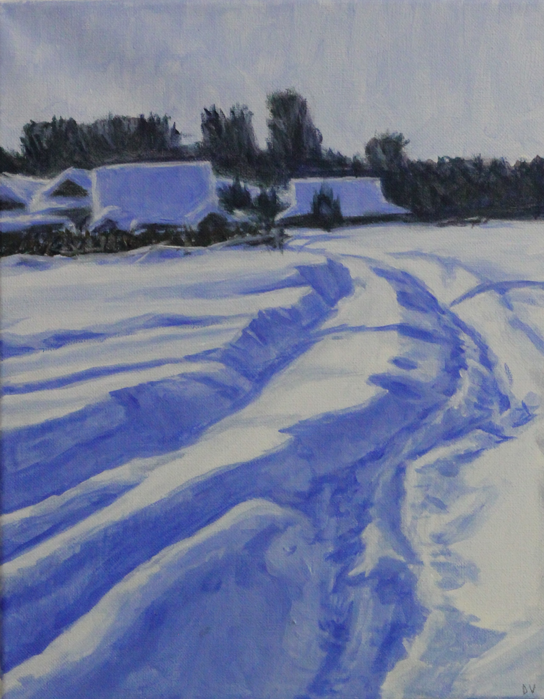
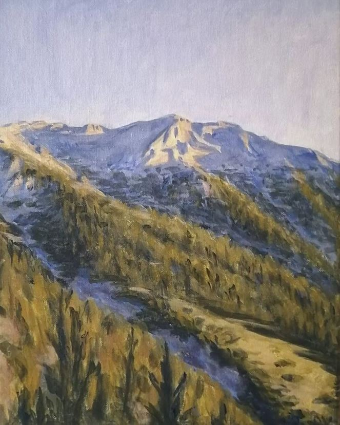
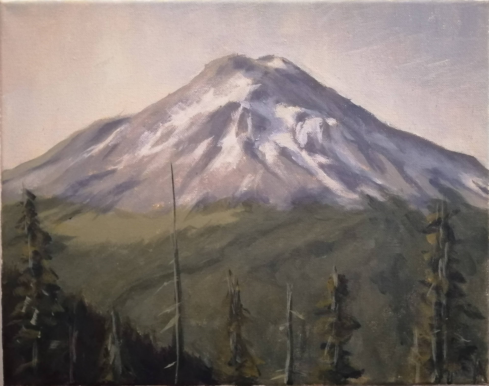

# Art

## Drawing and painting

You can check out some of my paintings and drawings on my [Instagram](https://www.instagram.com/darius.liutas/). I've been working on improving them every now and then for the past four years or so. Currently, I mostly work in acrylic and graphite.

## Video games and computational art

You can also check out various video game and computational art projects I've done on my [Itch.io](https://dariusliutas.itch.io/). I'm especially proud of [Scène de la Mer](https://dariusliutas.itch.io/scene-de-la-mer), a short poetry experience meant for Google Cardboard VR, and [Sailing Sands](https://dariusliutas.itch.io/sailing-sands), a solo contribution to McGill Game Jam in 2022.

<!DOCTYPE html>
<html lang="en">
<head>
  <meta charset="UTF-8">
  <title>Photo Gallery</title>
  <link rel="stylesheet" href="style.css">
</head>
<body>
  <h2>Gallery</h2>
  

    
    
    
    <!-- Add more images here -->
  

</body>
</html>
