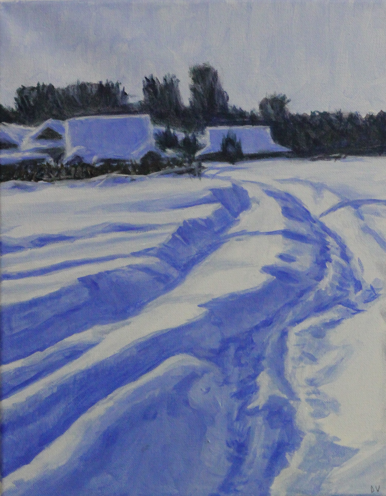
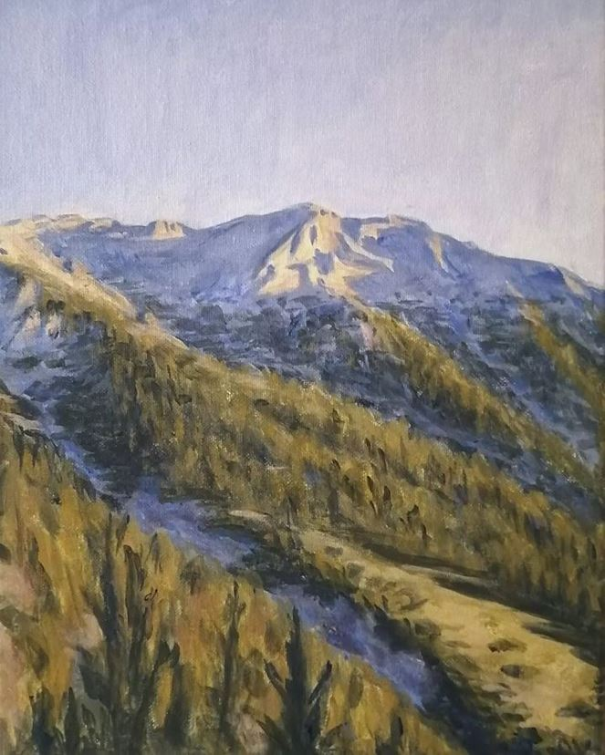
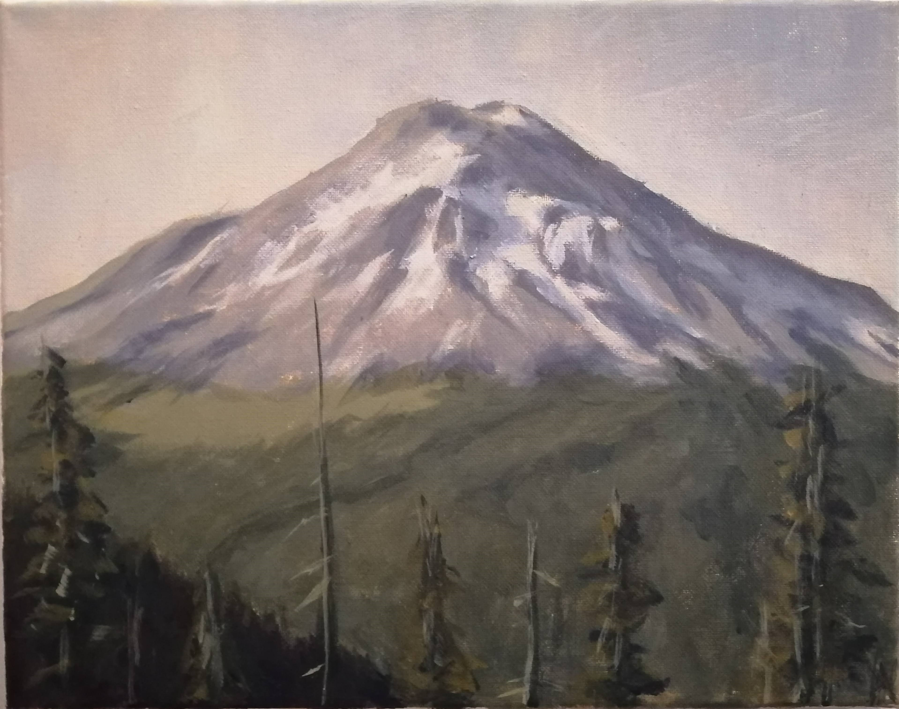

# Art

## Music

I have a Bandcamp now! My first (tiny, four-minute) EP is some music I wrote for a game jam in April 2026. Check it out [here.](https://dariusvalevicius.bandcamp.com/album/fear-not-little-lamb-original-score)

I've played the accordion for about fifteen years, and the guitar for about ten. Recently I've been picking up the violin as well as a zoo of other instruments that I more or less know how to handle.

## Drawing and painting

You can check out some of my paintings and drawings on my [Instagram](https://www.instagram.com/darius.liutas/). I've been working on improving them every now and then for the past six years or so. Currently, I mostly work in acrylic and graphite.

I've mostly stopped updating my instagram, but I am back on the painting grind as of 2026. If you'd like to commision a painting, feel free to reach out!

## Video games and computational art

You can also check out various video game and computational art projects I've done on my [Itch.io](https://dariusliutas.itch.io/). I'm especially proud of [Scène de la Mer](https://dariusliutas.itch.io/scene-de-la-mer), a short poetry experience meant for Google Cardboard VR, and [Sailing Sands](https://dariusliutas.itch.io/sailing-sands), a solo contribution to McGill Game Jam in 2022.

<!--
<html lang="en">
<head>
  <meta charset="UTF-8">
  <title>Photo Gallery</title>
  <link rel="stylesheet" href="style.css">
</head>
<body>
  <h2>Gallery</h2>
  

    
    
    
    <!-- Add more images here -->
<!--
  

</body>
</html>
-->
