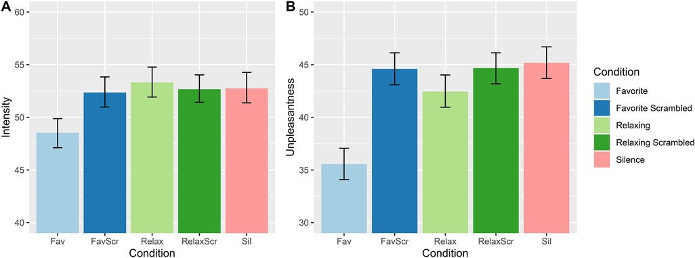
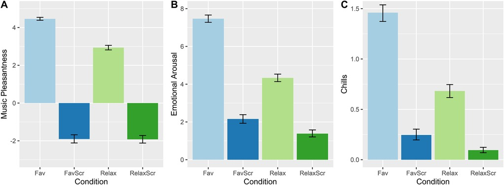

# Plain language summary: *Emotional responses to favorite and relaxing music predict music-induced hypoalgesia*, Valevicius et al. 2023

This is my first proper research paper and honestly doesn't really need a plain language study - it's a very accessible topic, explored in very accessible language. But this is a bit of a warm up for me for future plain-language summaries, and a reason to finally start populating my website with some blog stuff.

## Background

Music for pain relief has been this quirky little thing in pain treatment and research for some time, and possibly even stretching back far into the depths of history. Pythagoras (or someone or other1) believed different modes had different powers for healing ailments. Here, we explored the topic in more depth than the binary "yes/no", does it reduce pain or does it not question.

The first thing we did was to compare some specially composed relaxing music to our participants' favorite songs, which they could bring to the experiment. After kindly accepting to help us with our study, we proceeded to lightly torture them in a windowless room across from McGill's Roddick gates. We used a thermal probe - a little machine filled with a funny pink fluid that could ramp up or ramp down to temperatures between 40 and 50 C within a decimal point of precision.

After going through a laborious calibration procedure, we set the temperature to something that corresponded to a "50/100" on a scale from no pain to very high pain. This temperature remained constant, while what varied was the type of music that participants were listening to.

Participants rated two facets of pain - its intensity and its unpleasantness. These correspond to a fundamental dualism in what pain is. On the one hand, nociceptive fibres act basically like your somatosensory nerves, detecting certain types of pressure, shearing, as well as heat, cold, etc., and transporting that information up to the brain. But, a sensation alone doesn't have an affective value. That's something that seems to arise one the nociceptors reach the brain, and these two facets correlate, but not perfectly. Under some circumstances (like hyponosis), they can diverge pretty dramatically.

## Results

So first off, perhaps unsurprisingly, people's favorite songs worked waaaay better than the relaxing music, which had a bit of an elevator-y vibe (apparently, keeping it simple was part of the intentional design, but in some other unpublished research I found that complexity generally was better for pain relief).

The effect of favorite music is kind of serious, to be honest. In terms of standardized effect sizes, it's a Cohen's d of 0.7 for pain unpleasantness, and a little less for intensity (but intensity is rarely modulated by these kind of simple interventions). Some might react that it doesn't *really* reduce pain all that much, since in some people's minds pain is really identical to the sensation, rather than the (affective) feeling. But the affective part is really the only part that matters in practice. If pain doesn't bother you, it becomes sort of inert.

But anyway, the study doesn't stop there. If it did, it would be pretty boring. Unfortunately, in my little perusal of the papers that have cited this study (15 as I write this! Woohoo!), the above result is the only one that's mentioned.

So where did we go from here? Well, as well as collecting reports of pain intensity and unpleasantness, we collected some reports of emotional valence and arousal as well, plus a question about how many musical chills they experienced.

"Musical chills" are, I think, just chills (or "thrills", or "frissons"), we just specify they're the music-induced ones to not make any unintended generalizations.

So, in brief, favorite music succeded in being a bit more pleasant, much more emotionally arousing, and provoked way more chills. Cool! In a mediation analysis, we found that most of the difference in pain relief between the two conditions could be explained by these measures.

And now we get to the REALLY REALLY cool part. This is where I brought in some eclectic-ness and added a qualitative study to this quantitative study. On top of the simple visual-analog-scale measures, we asked people about what they experienced when they listened to their favorite songs. What emotions, thought, mental images, memories ran through their minds?

We then applied the classic workhorse method of qualitative psychology, theme analysis, to group the responses into a few neat categories. We did this iteratively in a group of four bright and bushy-tailed undergrads, which was super fun for me and I hope for everyone else.

Four major themes came out in the emotion department. They were...

### Happy/cheerful

Just your run-of-the-mill happy, upbeat, fun pop (or other) song. People listened to these to feel good, 

## Footnotes

1 Plato? Hippocrates? I can't remember, the reviewers made me scrap it from the manuscript.