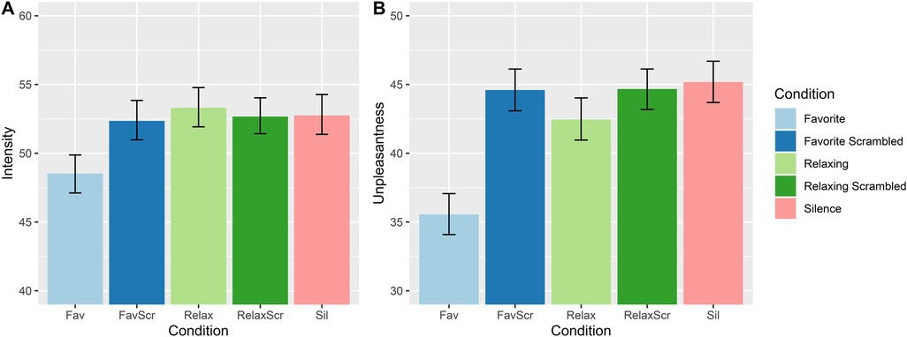
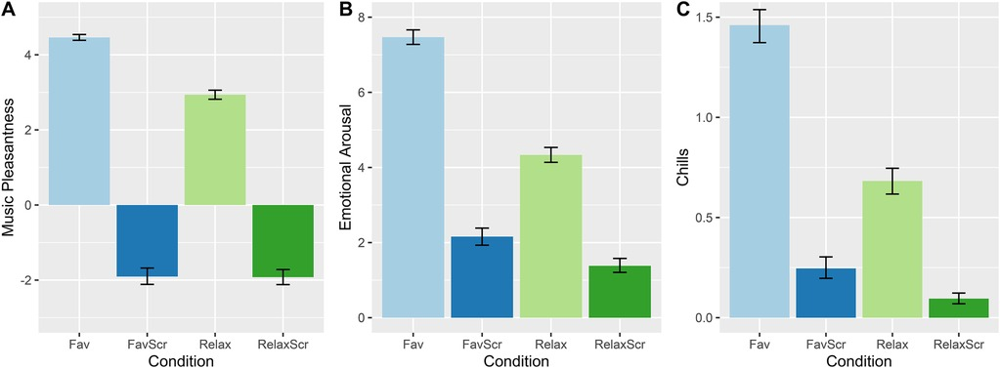
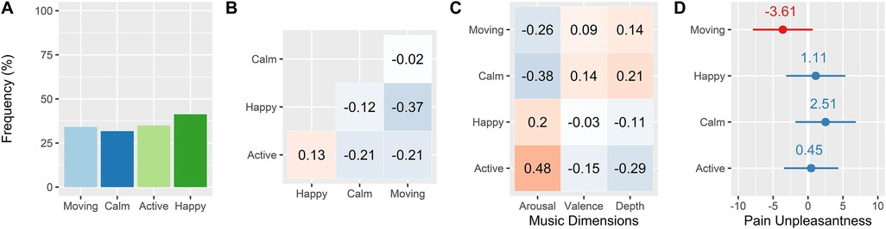

# Plain language summary: *Emotional responses to favorite and relaxing music predict music-induced hypoalgesia*

This is my first proper research paper and honestly doesn't really need a plain language study - it's a very accessible topic, explored in very accessible language. But this is a bit of a warm up for me for future plain-language summaries, and a reason to finally start populating my website with some blog stuff.

## Background

Music for pain relief has been this quirky little thing in pain treatment and research for some time, possibly even stretching back into the far depths of history. Pythagoras (or someone or other1) believed different musical modes had different powers for healing ailments. Here, we explored the topic in more depth than the binary "yes/no", does-it-reduce-pain-or-does-it-not question.

The first thing we did was to compare some specially composed relaxing music to our participants' favorite songs, which they could bring to the experiment. After kindly accepting to help us with our study, we proceeded to (gently) torture them in a windowless room near McGill's Roddick gates. We used a thermal probe - a little machine filled with a funny pink fluid that could ramp up or down to temperatures between 40 and 50 C within a decimal point of precision.

After going through a laborious calibration procedure, we set the temperature to something that corresponded to a "50/100" on a scale from no pain to extremely high pain. This temperature remained constant, while the type of music that participants were listening to varied.

Participants rated two facets of pain - its intensity and unpleasantness. These correspond to a fundamental dualism in what pain is. On the one hand, nociceptive fibres act basically like your somatosensory nerves, detecting certain types of pressure or tearing/shearing, as well as heat, cold, etc., and transporting that information up to the brain. But, a sensation alone doesn't have an affective (i.e. emotional) value. That's something that seems to arise one the nociceptors reach the brain. These two facets correlate, but not perfectly. Under some circumstances (like hyponosis), they can diverge pretty dramatically.

## Results

So first off, perhaps unsurprisingly, people's favorite songs worked waaaay better than the relaxing music, which had a bit of an elevator-y vibe (apparently, keeping it simple was part of the intentional design, but in some other unpublished research I found that complexity generally was better for pain relief).

The effect of favorite music is kind of serious, to be honest. In terms of standardized effect sizes, it's a Cohen's d of 0.7 for pain unpleasantness, and a little less for intensity (but intensity is rarely modulated by these kinds of simple interventions). Some might respond that it therefore doesn't *really* reduce pain all that much, since for some, pain is defined by the sensation rather than the (affective) feeling. But the affective part is really the only part that matters in practice - if pain doesn't bother you, then it's not much different from touch.

But anyway, the study doesn't stop there. If it did, it would be pretty boring. Unfortunately, in my little perusal of the papers that have cited this study (15 as I write this! Woohoo!), the above result is the only one that's mentioned.

So where did we go next? Well, in addition to collecting reports of pain intensity and unpleasantness, we collected reports of emotional valence and arousal, plus a question about how many musical chills participants experienced. Musical chills" are, I think, just chills (or "thrills", or "frissons"). We just specify they're the music-induced to not make any accidental broad claims.

So, in brief, favorite music succeeded in being a bit more pleasant, much more emotionally arousing, and provoked way more chills. Cool! In a mediation analysis, we found that most of the difference in pain relief between the two conditions could be explained by these measures.

And now we get to the REALLY REALLY cool part. This is where I brought in some eclectic-ness and added a qualitative study to this quantitative study. On top of the simple visual-analog-scale measures, we asked people about what they experienced when they listened to their favorite songs. What emotions, thought, mental images, memories ran through their minds?

We then applied the classic workhorse method of qualitative psychology, "thematic analysis" or theme analysis, to group the responses into a few neat categories. We did this iteratively as a group of four bright-eyed and bushy-tailed undergrads, which was super fun for me and I hope eqally for everyone else.

Four major themes came out in the emotion department. They were (1) Happy/cheerful music, your typical upbeat tunes, (2) Energizing/activating music, which was aggressive or at least high-amplitude, (3) Calming/relaxing music, which tended to soothe or chill out participants, and (4) Moving/bittersweet music, which aggregated sub-themes like strong negative or mixed emotions, spirituality, and other deeply meaningful experiences. This last theme was my favorite to analyze, since as a teenager and young adult I was drawn to the really emotional, melancholic types of music that resonated with the deep parts of myself2.

And, lo and behold, it was this fourth theme alone that seemed to have an additional effect on pain. While it didn't hit the statistical significance threshold, the size of the effect was again quite big, so given the smallish sample size and the amount of measurement noise (the fluctuating nature of pain self-report and the vagaries of qualitative analysis), I think there's probably a true effect in there. To corroborate this, we found that moving/bittersweet music got higher scores on the emotional valence and chills measures, which both correlated with reduced pain unpleasantness.

The feelings that moving/bittersweet music bring up for me are things like communion, relief, compassion, and healing. At the time I was reading Jaak Panksepp, and I thought that this might tie into his theory of social closeness - the opposite of his PANIC/GRIEF system - which he believed was mediated by endogenous opioid molecules, which are of course intimately linked with physical pain. Thus, cathartic music which soothes heartbreak and emotional pain could also have a specific effect on physical pain. More work would have to be done to test this particular hypothesis, though!

## Conclusion

This was a fun project to work on - I felt really lucky to work on music and emotion, two things I find super interesting. In particular, I'm proud of implementing a mixed methodology, basically by following my nose as I'd never received training in qualitative research. It seems to have turned up some pretty neat results, and I'm continuing in that tradition of including phenomenological reports in my PhD research.

Because of a press release given by Frontiers, the paper got picked up by the media cycle, and currently has an Altmetric score of 1023, which is absolutely insane (!!). But again - I wish people paid more attention to the last few analyses, which is where I think we really added something to the conversation. What do you think?

## Footnotes

1 Plato? Hippocrates? I can't remember, the reviewers made me scrap it from the manuscript.

2 If you must know, that was shit like The National, Daughter, Death Cab, Keaton Henson... If you know anything about those, don't worry, I'm OK now. Also the Daughter comeback album is fucking amazing.

## Citation

Valevicius, D., Lépine Lopez, A., Diushekeeva, A., Lee, A. C., & Roy, M. (2023). Emotional responses to favorite and relaxing music predict music-induced hypoalgesia. Frontiers in pain research, 4, 1210572.