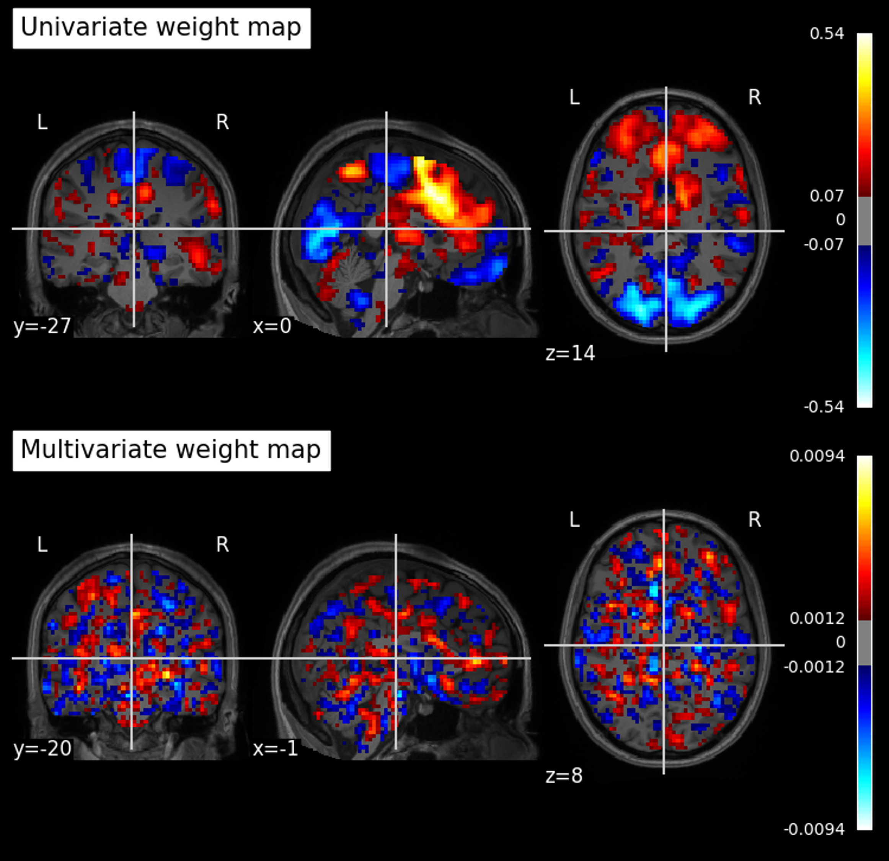
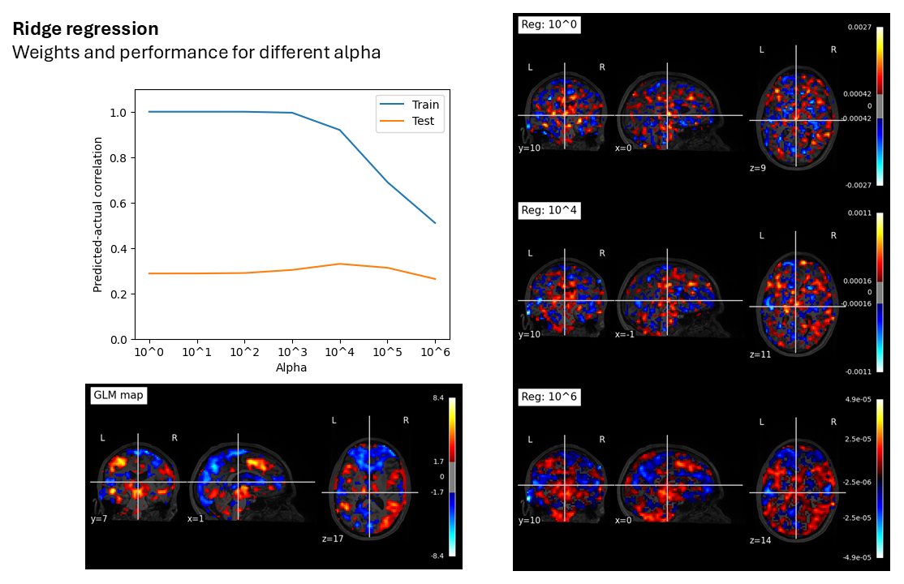

# Some thoughts and sufferances on fMRI decoding
My field notes from the past year, hopefully helpful to initiates and veterans alike.
## Introduction
I spent the better part of last year in Machine Learning Hell – running countless models, trying this preprocessing step and that, obsessing over my cross-validation folds, waiting eons for my grid searches to complete, and wracking my brain trying to understand what the hell was even going on under the hood.

Decoding models are, as I was deflated to discover, generally a single-layer multivariate regression model, with occasionally a bell or whistle in the form of a regularization term, a logistic transformation, or some arcane high-dimensional foolery (support vector machines, or SVMs). But it basically boils down to solving a regression problem with multiple predictors - in this case fMRI voxel values - and an outcome variable (in my case, subjective fear ratings).

After going through many levels of ML Hell, I have come out the other side kissing the ground of univariate (encoding) analyses. I love my little Pearson correlations to death, and I will try to explain some of the reasons why in this little blog-post-adventure.

One disclaimer before we begin: I’m not a super math-y person, I didn’t complete a degree in comp sci or statistics, and thus I’m not equipped to understand everything to the level of a real virtuoso. There might be a mistake here and there. Instead, I’m a generalist and an obsessive tinkerer and question-asker. Most of my understanding of these things is at a relatively conceptual and abstract level, with a dash of pragmatism, and a fool’s hope that I haven’t gotten it all wrong.

## Part 1: The curse of dimensionality

While many decoding analyses in fMRI restrict the search to a single region of interest at a time, or in the case of “searchlight” analysis, a modest bubble of brain voxels, whole-brain decoding is also a common practice. After all, why would you limit yourself? In decoding from some regions and not others, you are baking in assumptions about what brain regions are relevant to a task. In addition, you may miss certain interactions between far-flung regions which work together to produce your phenomenon of interest.

The problem is that it’s just waaay too many features. Even in a single ROI, depending on the resolution of your data, you may have hundreds or thousands of voxels. In a typical study, your training samples (experimental trials) may only be in the hundreds. As soon as you have more features than samples, you’re wading into murky waters. Depending on the noise and frequency profiles of your predictors, you may be able to effectively approximate the shape of any arbitrary outcome vector.

With whole-brain decoding, this problem is awful. A typical 3x3x3mm fMRI volume that I work with has 50k-70k voxels, for which I can produce at most around 500 training samples before my subject falls asleep or enters some kind of trance state. Combining data across subjects may help, but then you’re dealing with memory issues due to your insanely large matrices, and between-subject variance that might fuck up your model’s fit.

There are two ways that this is usually mitigated. The first is to use cross-validation. By testing your model’s performance on held-out data, you can have a pretty good idea of how well it has captured the true effect, free of overfitting. However, this definition of overfitting has continually rubbed me the wrong way. If my model is capable of perfectly fitting the outcome vector in the training data (even when the data is shuffled or misaligned), then most of the model’s weights represent relationships which are totally spurious. Even if I get some out-of-sample performance in the 10-20% variance explained range, I wouldn’t trust this model as far as I could throw it. I doubt that it would generalize well to a dataset with a different preprocessing pipeline, task structure, etc. given the amount of noise that is built into its weight matrix. And, of course, the weights are totally uninterpretable – the scientific value of the model itself is basically nil.

*Figure 1. A comparison between a mass univariate weight map (using Pearson correlation) and the output of a multivariate Linear SVM model. I call the latter a “Macaroni Salad Map”, because that’s what it looks like. Applying these models to held-out data (using a similarity metric like cosine similarity, dot product, or Pearson correlation) gives you effectively the same predictive performance. In this case the univariate map performs better, with a predicted-actual correlation of 0.57; the multivariate model, 0.40.*

The second method of mitigating the curse of dimensionality is regularization. Ridge is typically preferred over LASSO for fMRI data, since one expects a smooth distribution of weight values over neighboring voxels to be closer to the real causal structure, rather than isolated, scattered voxels as LASSO would produce. SVMs also have their own regularization parameter. However, for whole-brain decoding, I find I have to crank this parameter to astronomical values to even begin to mitigate the rampant overfitting on the training set. The parameters I need to use far exceed those used in whole-brain decoding papers I’ve read.

*Figure 2. The effect of different regularization parameters on train and test performance for a single subject’s data. X = around 50k voxels, with around 400 data samples; y = fear ratings associated with stimuli. An apha value of around 10,000 is required to start to attentuate the “perfect fit” to the training data. The results with a linear SVR model are extremely similar, but the model will crash before the train performance dips too much.*

As the regularization parameter hits insane values, the weight map starts to resemble the mass univariate analysis anyway. This lends additional ammunition to the [argument by Vigotsky et al.](https://doi.org/10.1016/j.tics.2024.06.004) that we should be decoding using GLM maps or something similar, since the performance is basically identical, without the overfitting, and with a simple interpretation of the weight map.

What I think the multivariate weight maps are doing in these situations is basically finding voxels that exist at the “peaks” and “troughs” of the mass univariate map, extracting relevant information from those, and then using the remaining voxels to overfit to the training data. You can sort of see this in Figure 2 – hotspots in the ACC and thalamus are captured with single voxels, which spread out into the actual activity patterns as regularization is increased to merciless levels, all without a drop in test performance.

## Part 2: The Wizard’s warning

Last year at CCN, after a brief talk on a new RSA similarity metric in which my poor programming-and-philosophy brain was bombarded with equations and mathematical terms far beyond my comprehension, a small Wizard approached the microphone to give a critique. In the two minutes that followed, there was an incomprehensible back-and-forth, which was made worse by the Wizard’s thick accent and brief manner of expressing his points. In the end the exchange came to an awkward standstill and the Wizard sat back down. I got the feeling that the crowd and the speaker saw him as a crazy old coot, but I wanted to know more.

In the end I think the accent was the main obstacle, as well as maybe the harsh approach of criticizing a talk in front of a crowd. On seeking his counsel, I found out the Wizard’s point was simple: In similarity analysis, you essentially have angle and magnitude.  If a vector of voxel values A expresses a similar pattern of activation to vector B, they have a small angle distance. If their magnitude is also similar, then the Euclidean distance between the two will also be small. However, if vector A expresses the same pattern, but at three times the magnitude of vector B, then the Euclidean distance is now large. Larger, perhaps, than the distance between vector B and a third vector C, even if B and C point in opposite directions.

It gets even more complicated if you consider the preprocessing steps involved. De-meaning data, or regressing out global signal, will move the origin of the vectors, which affect both angles as well as magnitudes (but perhaps principally angles). Vectors A and B from before (where A = 3B), if the origin is moved up along the vector direction a bit, may now point in opposite directions and have a large angle difference.

Cosine similarity (i.e. the normalized dot product) measures angle difference. Dot product measures a combination of angle and magnitude. Pearson correlation measures angle after de-meaning both vectors. Each of these will produce a somewhat different result from the others, and from itself depending on the preprocessing steps involved. Each of these is also a viable candidate for creating outcome predictions in fMRI decoding (I believe dot product is likely the most common, followed by cosine similarity). The biggest risk is, I think, with the use of dot product. Since it hinges on magnitude, the decoder weights containing more positive than negative values may cause it to correlate with any change in global signal. As I’ve found in some of my own data, relying on dot product may lead you to believe you’re decoding some state, but if your state is even a little bit associated with average BOLD level or brain arousal (which many things are), your model might be picking up on nothing but this mean signal.

Another danger is, when applying angle similarity measures, you may get better performance in regions that have higher dimensionality, since they simply have a larger number of potentially discriminable patterns. A lower-dimensional BOLD signal in a smaller ROI, or one with less spatially patterned activity, may be able to leverage magnitude, but this will be missed if only measuring angle. ROI-wise decoding therefore has to consider differences in dimensionality between ROIs.

The Wizard’s warning was basically this: You can dress things up with fancy math all you want, but if you don’t think carefully about these fundamentals of angle and magnitude, your results may be uninterpretable.

## Part 3: Concluding remarks

A couple of papers by Vania Apkarian’s group ([1](https://doi.org/10.1016/j.cortex.2021.12.015), [2](https://doi.org/10.1016/j.tics.2024.06.004)) lay out several additional criticisms of fMRI decoding. Here’s a summary of some of them off the top of my head:
-	When the number of features is greater than the number of training samples, the regression problem is ill-posed. Hence, infinitely many weight vectors may have identical performances (non-uniqueness), which they show by comparing the performance of three very different pain decoders from the literature, and finding that they work basically just as well as one another, even when manipulated and degraded in serious ways.
-	Multivariate models can leverage noise profiles, which means they are unlikely to generalize well to other datasets with different acquisition parameters and preprocessing pipelines. For example, a model might use a negative weight on voxel A, which shares a noise profile but not a signal of interest with voxel B, thus “cleaning” the signal derived from voxel B. In another dataset, this may hinder rather than help.
-	They recommend computing similarity using encoding models (like a GLM map) to predict outcome variables, as this preserves uniqueness, biological plausibility, and interpretability. I’ve created a [hyper-optimized SKLearn estimator](https://github.com/dariusvalevicius/cosinedecoder) that does this using voxel-wise Pearson correlation values, which tend to correlate at r > 0.9 with GLM outputs.

[A paper by Martin Hebart and Chris Baker](https://doi.org/10.1016/j.neuroimage.2017.08.005) also lays out some critiques and principles:
-	Because decoder performance can be influenced by so many exogenous factors, comparing decoding performances across subjects or datasets may return spurious results. Comparing the performance of decoders (for example, across ROIs) can only be done in an interpretable manner within a single dataset, where these factors are identical.
-	We need to be clear about interpreting results in an “activation-based” framework, where weights correspond to higher or lower activity in response to a stimulus; versus an “information-based” framework, in which we want to estimate the mutual information between a whole population of voxels and an outcome vector, but where the individual weights do not have a clear meaning. (Although my estimator on GitHub, I would argue, blends the two without violating the assumptions of either one).

If you’ve made it this far, wow! You get a gold star from me, genuinely. I hope you find this helpful in some way. If you have any comments or questions, shoot them to me via email or Bluesky DM, and I will try to revise this post at some point in the future.
